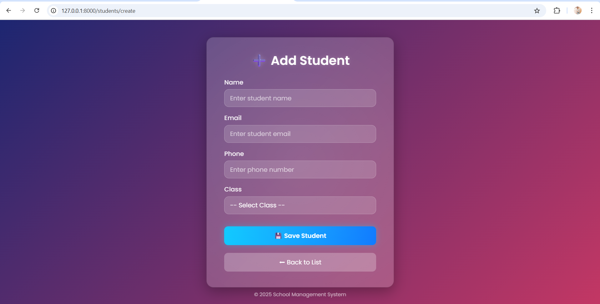
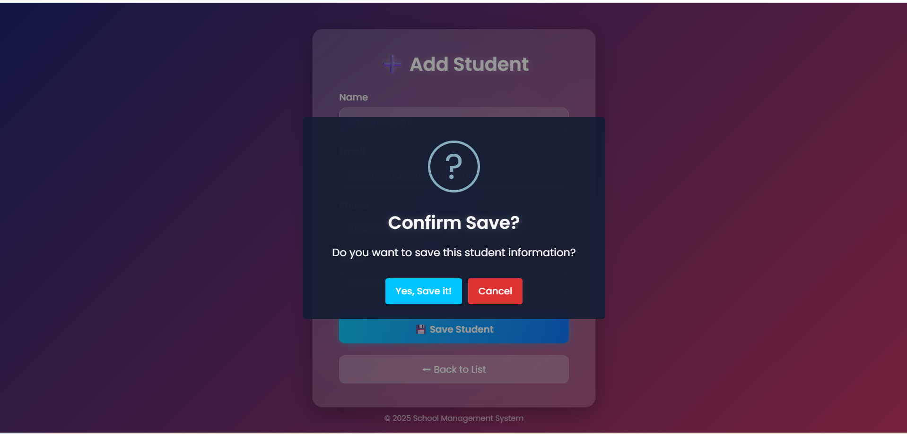
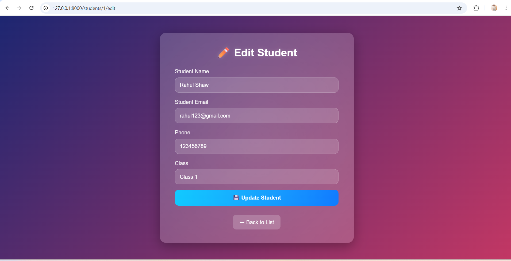
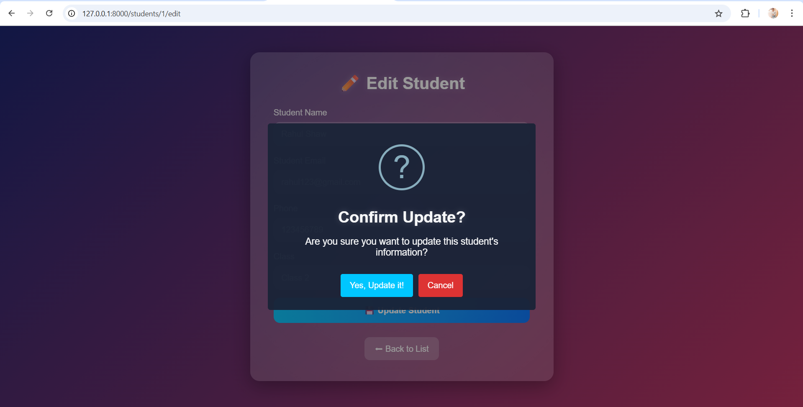
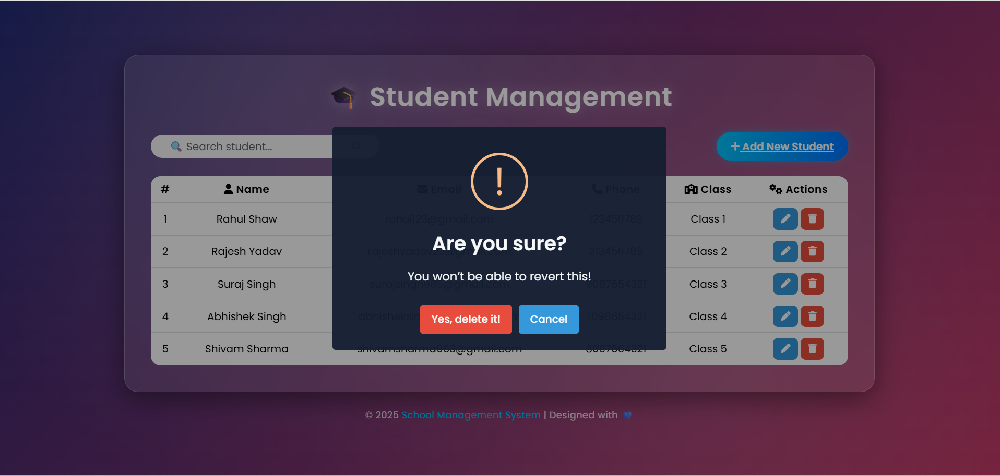

Laravel Student Management System (CRUD Application)

A modern and responsive CRUD (Create, Read, Update, Delete) application built with Laravel 11 and MySQL for managing student records efficiently.
This project demonstrates clean backend logic, structured Blade templates, and user-friendly modals for add, edit, and delete operations — a great example of full-stack Laravel CRUD implementation.
## 🖼️ Screenshots

### ➕ Add Student Popup

### ✏️ Edit Student Popup

### ✅ Update Success Message

### ❌ Delete Confirmation

